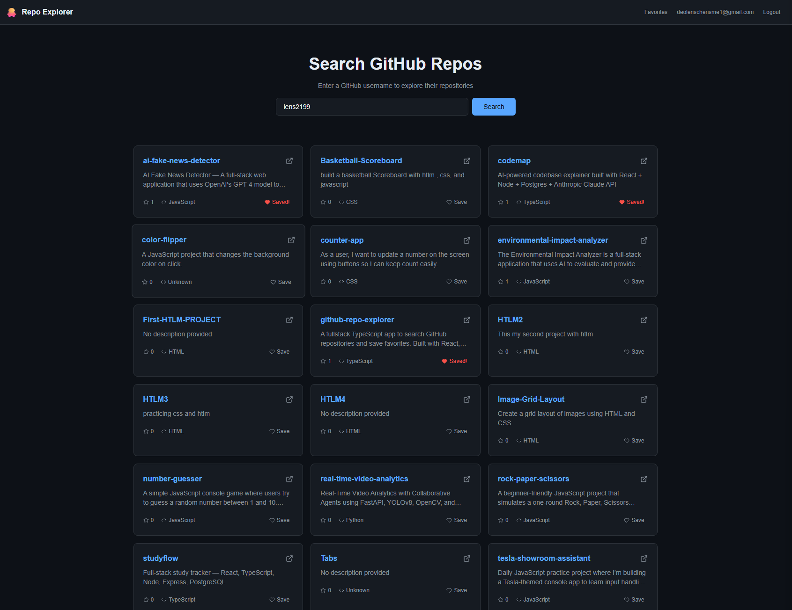

# GitHub Repo Explorer

A full-stack app that lets you search any GitHub user's repositories and save your favorites.

**Live Demo:** [https://github-repo-explorer-phi.vercel.app](https://github-repo-explorer-phi.vercel.app)




## Features

- Search any public GitHub user's repositories by username
- View repo details at a glance: stars, primary language, and description
- Create an account and log in securely with JWT-based authentication
- Save repositories as favorites, and revisit them anytime from a dedicated page
- Remove favorites just as easily, keeping your saved list up to date

## Tech Stack

**Frontend**
- React
- TypeScript
- Vite
- Axios

**Backend**
- Node.js
- Express
- TypeScript
- MongoDB (Mongoose)
- JWT Authentication

**Deployment**
- Frontend hosted on Vercel
- Backend hosted on Render
- Database hosted on MongoDB Atlas

## Setup

Backend:
```bash
cd backend
npm install
```

Create a `.env` file in `backend/` with:
```
MONGODB_URI=your_mongodb_connection_string_here
JWT_SECRET=your_secret_key_here
```

```bash
npm run dev
```

Frontend (separate terminal):
```bash
cd frontend
npm install
```

Create a `.env` file in `frontend/` with:
```
VITE_API_URL=https://github-repo-explorer-api.onrender.com
```

```bash
npm run dev
```